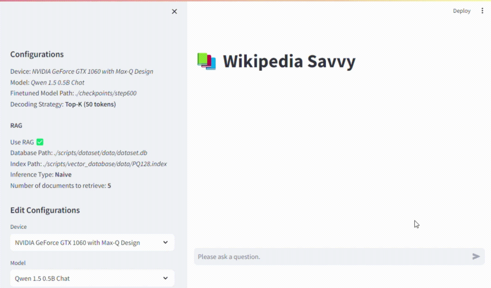
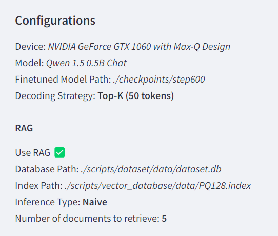
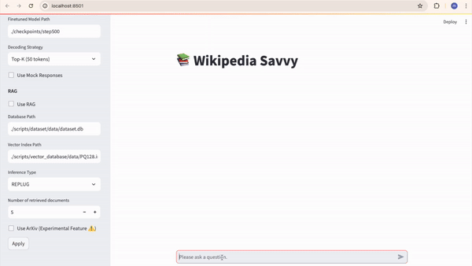
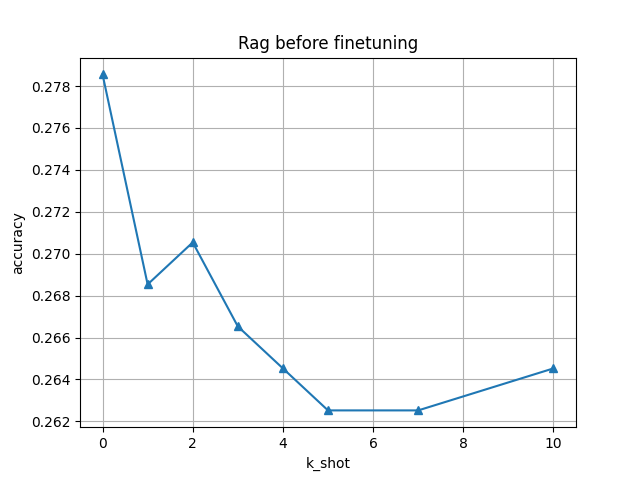

# Wikipedia-Savvy-RAG



For our project, we implemented, fine-tuned, and evaluated a Retrieval Augmented Generation system that can discuss a range of topics in the STEM domain. Importantly, we put a lot of effort into coding (almost) everything from scratch ourselves, from filtering, cleaning and embedding the 100GB wikipedia dump, to the inference code for RAG with various prompting, aggregation and decoding strategies, to the code for running benchmarks with mmlu, all the way to the training and evaluation loops and the logging of a variety of metrics to weights and biases during finetuning.
To showcase our system, we developed a simple Streamlit application with a chat interface that replies to the user prompts with the help of retrieved Wikipedia passages.

We downloaded, filtered and cleaned the English Wikipedia (~100GB) and built a vector database of semantic embeddings based on all STEM articles, using the FAISS library for efficient retrieval of embeddings and SQLite for accessing text chunks from disk. After filtering, the xml dumpm of wikipedia went down to 22GB, and after cleaning it went all the way to 8GB of clean text. We then built a RAG system using the open-source LLM `Qwen/Qwen1.5-0.5B-Chat` and the embedder `BAAI/bge-small-en-v1.5`.

To improve the performance of our system, we kept the embedder frozen and fine-tuned the LLM on a subset of the Yahoo Answers dataset, using QLORA to speed up training and reduce the memory footprint. As a training objective, we used the cross entropy loss between predicted logits and ground truth answer, which allows to exploit the inherent parallelism of the transformer architecture. To develop the training code, we started from an existing project of one of us, publicly available at https://github.com/MattiaSC01/JEPA, which offers a Trainer class to handle the training and evaluation loops, and a Logger class to handle interactions with weights and biases. The Trainer class can be subclassed to have model-specific behaviour, as we did.

To evaluate our system, we considered its accuracy on a subset of the MMLU benchmark focusing on STEM questions. We assessed the performance with and without RAG, and we considered its evolution during finetuning. We also ran a number of ablations concerning the number of retrieved documents, the generation strategy, the number of provided examples in the prompt.

The chat was developed using Streamlit and allows users to configure key aspects of the chatbot, such as selecting the model, determining the number of retrieved documents, choosing the type of RAG inference, and setting the decoding strategy.

## Project Structure

Our project is organized into the following directories:

- `backend`: This directory contains the core code for the RAG handler, LLM handler, embedder wrapper, vector database wrapper, and model trainer. It also includes various utility functions used throughout the project. For convenience, it is installed as a package (see the Installation section).
- `bash_scripts`: This directory contains our bash script definitions.
- `configs`: This directory holds YAML configuration files for initializing the RAG handler.
- `frontend`: This directory includes the code for the ChatBot demo interface.
- `notebooks`: This directory contains Python notebooks primarily used for exploratory data analysis.
- `scripts`: This directory has scripts for building the dataset, computing embeddings, training models, constructing the FAISS vector database, fine-tuning the model, and benchmarking with MMLU.
- `wikidump_processing`: This directory includes all the code for retrieving, processing, and cleaning the Wikipedia dump.

## Preliminary steps

The following steps are required to both run the ChatBot and to replicate our results on the MMLU evaluation dataset.

Since we are aware that executing all the steps is computationally demanding, we link a
zip files containing all the required files to run the ChatBot and the benchmarks at [this link](https://bocconi-my.sharepoint.com/:u:/g/personal/federico_zarantonello_studbocconi_it/ESKBb1Hh7hFJhPzT-LvENOQBH0MqysZM9AtW_jdhYzqn1A?e=prSAOp).
Simply copy and paste the content of the unzipped directory in the project root and you should be fine!

### Installation

From the root directory:

```
pip install -r requirements.txt
pip install -e .
git clone https://github.com/MattiaSC01/JEPA.git
cd JEPA
pip install -r requirements.txt
pip install -e .
```

These commands are neatly packaged in a shell script. You can simply run, from the root:

```
bash bash_scripts/installation.sh
```

### Download the Wikipedia Dump

The Wikipedia Dump can be downloaded from [WikiMedia](https://meta.wikimedia.org/wiki/Data_dump_torrents#English_Wikipedia).
The required space on disk is about 100GB.
We used the version dated 2023-12-20.

### Process the Wikipedia Dump

Run the following script from the root directory to run the processing of the Wikipedia dump.  
At the end of the script you should have the cleaned and processed version in the `wikidump_processing/data/subsample_chunkeder.xml` file.  
The required space on disk is about 26GB.

```bash
bash wikidump_processing/clean_dump.sh /path/to/dump.xml True
```

### Create SQLite dataset

Run the following script to create and populate a SQLite dataset containing the Wikipedia chunks.
The required space on disk is about 9GB.

```bash
python scripts/dataset/populate_dataset.py --input "wikidump_processing/data/subsample_chunkeder.xml" --db_dir "scripts/dataset/data" --db_name="dataset"
```

### Compute embeddings

The following script calculates the embeddings and dumps them on multiple files in the specified directory (be sure that the directory exists)
The required space on disk for all the embeddings is about 20GB.

```bash
python scripts/embeddings/compute_embeddings.py --device "cuda" --db_dir "scripts/dataset/data" --db_name="dataset" --output_dir "scripts/embeddings/data/" --max_accumulation 250
```

Since the computation of the embeddings is heavy and might cause troubles (like out of memory errors), we created a bash script that runs multiple instances of the script:

```bash
bash bash_scripts/compute_embeddings_magistralis.sh
```

### Build vector database

The following script builds the vector database with the given index factory string (refer to [faiss documentation](https://github.com/facebookresearch/faiss)).  
The required space on disk depends on the chosen index factory.

```bash
python scripts/vector_database/train_vector_database.py --index "PQ128" --training_size 0.01 --input_dir "scripts/embeddings/data" --output "scripts/vector_database/data/PQ128.index"
```

The exact configuration we used is in the following bash script:

```bash
bash bash_scripts/train_vector_database.sh
```

## ChatBot

To run the ChatBot demo, run the following script:

```bash
    streamlit run frontend/app.py
```

To be able to use the Retrieval Augmented Generation with chunks from Wikipedia, the ChatBot requires to have in your system the following files:

- **SQLite database file**: this is produced by following [these instructions](#create-sqlite-dataset).
- **Vector database**: produced by following [these instructions](#build-vector-database).

To be able to run using a finetuned model, you need also the adapter files (see the [Finetuning the LLM](#finetuning-the-llm) section).

### Options

The demo allows users to customize configuration options, as shown in the following screenshot:



All options can be configured directly through the chatbot's UI:

- **Device**: Users can select from all compatible devices available on their machine. If a CUDA-enabled graphics card is present, it is recommended to select it for improved performance.
- **Model**: Choose between `Qwen/Qwen1.5-0.5B-Chat`, a finetuned version of it, and `microsoft/phi-3-mini-128k-instruct`. Despite all our analysis were done on Qwen 1.5, we inserted also Microsoft's Phi-3 for comparison. These models require approximately 2GB and 16GB of memory on the selected device, respectively.
- **Finetuned Model Path**: Path to the finetuned checkpoint to use.
- **Decoding Strategy**: Supported options include:
  - Greedy decoding
  - Top-k decoding (considering 50 tokens)
  - Top-p decoding (with a cumulative probability of 0.9)
- **Use RAG**: Option to retrieve and use documents to enhance the assistant's replies.
- **Database Path**: Path to the SQLite database.
- **Vector Index Path**: Path to the vector database.
- **Inference Type**: Defines how to use retrieved documents during inference:
  - **Naive**: Append all documents before the query and perform inference based on that.
  - **REPLUG**: Append each document to the query separately, determine token probabilities, and calculate weighted averages of these tokens based on document similarity. For more information, see the [REPLUG](https://arxiv.org/abs/2301.12652) paper.
- **Number of Documents to Retrieve**: Specify the number of documents to retrieve.
- **Mock Responses**: Whether to mock responses (for testing purposes).
- **Use ArXiv**: Whether to use the experimental feature of uploading ArXiv papers through the chatbot for question-answering about them.

### Notes for future improvements

Currently, with the RAG option enabled, the chatbot only considers the user's prompt and does not take into account the history of previous messages. Integrating memory handling with RAG is outside the scope of this project. However, future enhancements may include this capability.

### ArXiv (Experimental feature)

When the Use ArXiv flag is enabled, it will be possible to use ArXiv papers, in addition to wikidumps, in the RAG process. You can share papers either by sharing links using the chat or by directly uploading them from your device. You can also choose to use both methods simultaneously. Papers will be downloaded locally (temp) and automatically deleted after usage. LaTeX files will be parsed, and chunks will be created.
The possibility of retrieving papers from references of a given paper, and use them in RAG, may be included in future enhancements. 




## Our results (and how to reproduce them)

This section outlines the benchmarks we performed and the results we obtained.
To reproduce our results, ensure to first run the preliminary scripts using our configurations, which are defined in the provided bash scripts in the directory `bash_scripts`.

### Benchmark on FAISS indices

To choose the best index among those offered by FAISS, we conducted benchmarks evaluating several metrics: the intersection measure of the results compared to the true ordering, the time taken to retrieve documents for all queries, and the index size on disk (which provides a lower bound for its true memory size).

To run your own benchmarks, use the following script:

```bash
python scripts/vector_database/benchmark_faiss.py --knn_neighbors 100 --nprobe 32 --training_size 0.01 --mmlu_sample_size 300
```

In our evaluation, we trained our indexes on 1% of Wikipedia data and assessed the intersection measure for 1, 10, 50, and 100 results (with `knn_neighbors` specifying the maximum number of neighbors to retrieve). We evaluated 300 questions from the MMLU dataset and set the number of centroids for the IVF indexes to 32 (`nprobe`, for more details, refer to the [FAISS documentation](https://github.com/facebookresearch/faiss)).

Here is a table summarizing our results:

| Index                                 | Rank 1 | Rank 10 | Rank 50 | Rank 100 | Elapsed Time | Size on Disk (bytes) |
| ------------------------------------- | ------ | ------- | ------- | -------- | ------------ | -------------------- |
| SQ4                                   | 0.72   | 0.832   | 0.8477  | 0.8558   | 03:53.59     | 2,609,777,937        |
| SQ8                                   | 0.99   | 0.9873  | 0.9885  | 0.9892   | 03:29.50     | 5,219,552,721        |
| PQ64                                  | 0.4167 | 0.535   | 0.5798  | 0.5919   | 00:52.62     | 870,318,230          |
| PQ128                                 | 0.63   | 0.781   | 0.8038  | 0.8144   | 01:55.76     | 1,740,243,158        |
| OPQ64_256,IVF1000_HNSW32,PQ64x4fsr    | 0.18   | 0.2613  | 0.2797  | 0.2834   | 00:00.11     | 545,916,084          |
| OPQ64_256,IVF2000_HNSW32,PQ64x4fsr    | 0.14   | 0.2493  | 0.2694  | 0.2755   | 00:00.01     | 547,695,892          |
| OPQ64_256,IVF5000_HNSW32,PQ64x4fsr    | 0.1433 | 0.247   | 0.2717  | 0.2714   | 00:00.01     | 553,176,884          |
| OPQ128_512,IVF1000_HNSW32,PQ128x4fsr  | 0.2867 | 0.368   | 0.3849  | 0.3829   | 00:00.01     | 982,815,924          |
| OPQ128_512,IVF2000_HNSW32,PQ128x4fsr  | 0.2967 | 0.3433  | 0.3653  | 0.3656   | 00:00.01     | 986,153,236          |
| OPQ128_512,IVF5000_HNSW32,PQ128x4fsr  | 0.25   | 0.3233  | 0.3409  | 0.3340   | 00:00.01     | 996,253,492          |
| OPQ256_1024,IVF1000_HNSW32,PQ256x4fsr | 0.4067 | 0.4643  | 0.4737  | 0.4730   | 00:00.03     | 1,856,656,564        |
| OPQ256_1024,IVF2000_HNSW32,PQ256x4fsr | 0.3833 | 0.438   | 0.4435  | 0.4390   | 00:00.02     | 1,862,908,180        |
| OPQ256_1024,IVF5000_HNSW32,PQ256x4fsr | 0.3467 | 0.388   | 0.3802  | 0.3666   | 00:00.02     | 1,882,214,196        |
| HNSW16_SQ4                            | 0.5933 | 0.661   | 0.5829  | 0.4872   | 00:00.11     | 4,570,780,394        |
| HNSW16_PQ12                           | 0.0    | 0.0037  | 0.0055  | 0.0050   | 00:00.01     | 2,124,506,683        |
| HNSW16_PQ24                           | 0.0    | 0.002   | 0.0021  | 0.0021   | 00:00.01     | 2,287,617,607        |
| HNSW32_PQ12                           | 0.0333 | 0.0733  | 0.1001  | 0.1097   | 00:00.02     | 3,862,425,891        |
| HNSW32_PQ24                           | 0.24   | 0.3193  | 0.353   | 0.3486   | 00:00.04     | 4,025,536,815        |

The index we chose is PQ128 because it was a good compromise between accuracy, speed and size on memory.

### Finetuning the LLM

We finetuned our RAG system keeping frozen the embedder. We used the pytorch and peft libraries to finetune the llm with QLORA. Our training configuration can be found in `configs/training/final.yaml`. To replicate the finetuning, run:

```bash
python scripts/training/train.py --config_path configs/training/final.yaml
```

### Benchmark on MMLU

The Measuring Massive Multitask Language Understanding (MMLU) is a collection of multiple-choice questions that spans a wide range of topics.
We hand-picked the subcategories that according to us were part of the STEM domain and obtain a total of about 3000 questions.

We benchmarked the system considering different variations of it. First we compared the performances changing the number of retrieved passages; then we changed the number of examples in the prompt; finally we compared the different inference strategies (naive and REPLUG).
To assess the performances throughout training steps, we compared the performances of different model checkpoints.

In general, to run a benchmark execute the following script:

```bash
python scripts/benchmark/mmlu.py --split "test" --subset "stem" --output "/path/to/output.json" --k_shot 1 --batch_size 1 --config_path "/path/to/config.yaml" --use_rag True --n_docs_retrieved 3 --log_answers True --inference_type "replug"
```

Refer to the bash scripts in the folders `bash_scripts/benchmark_original_model` for benchmarks on different variation of the original model and to the `bash_scripts/chkpts_bench` for benchmarks on the training checkpoints.

Following the results for various numbers of documents retrieved by the model:


Following the results on the benchmark for various values of the examples (shots) given to the model:



Here an histogram summarizing the difference between the naive and the REPLUG on methods on 1 (silly scenario) and 3 retrieved documents.


